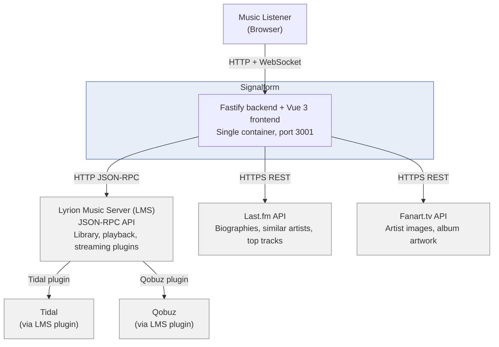
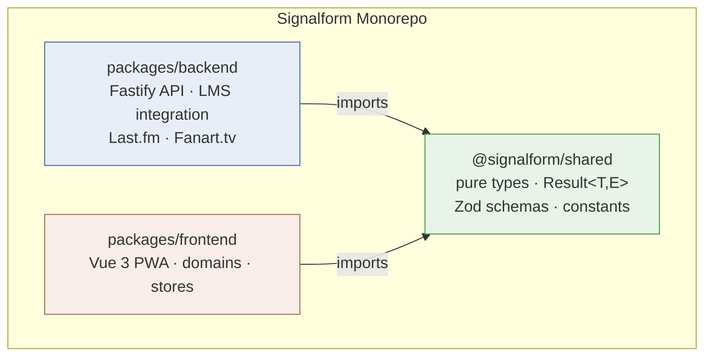
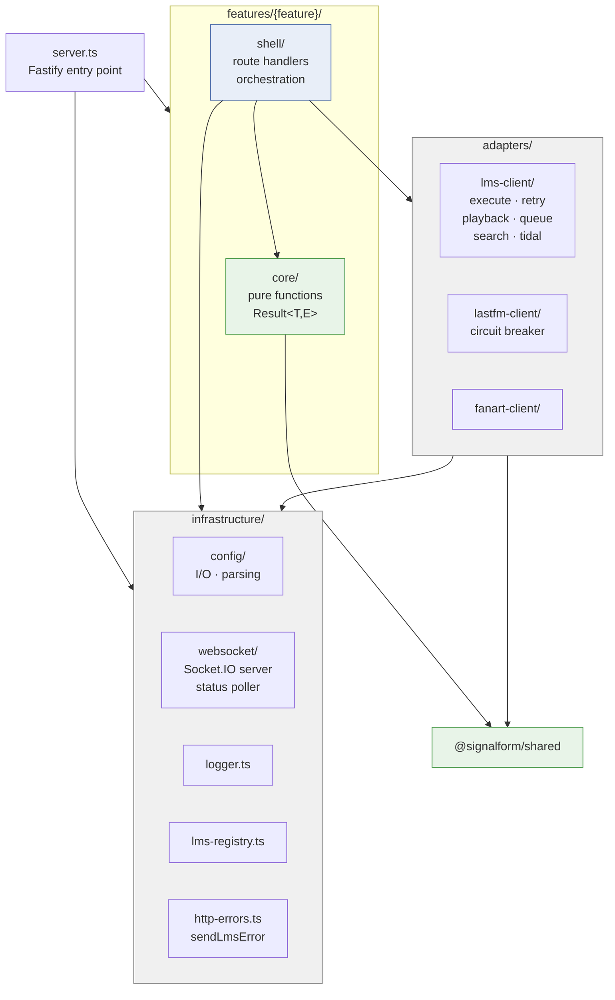
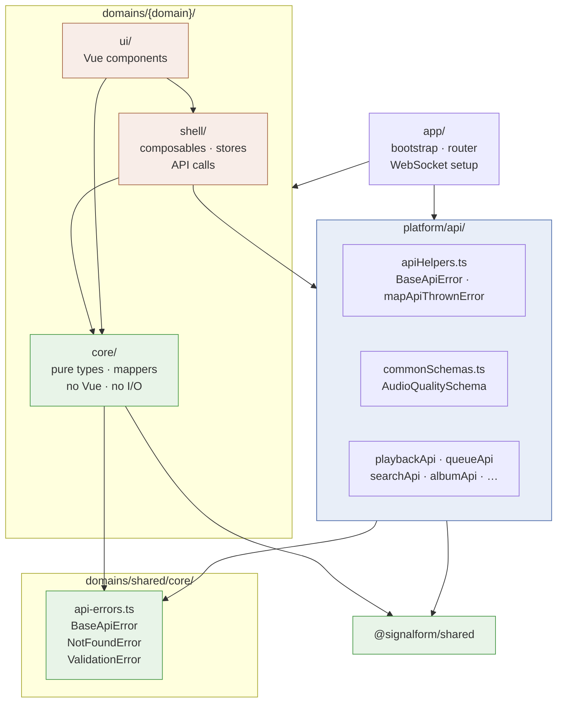
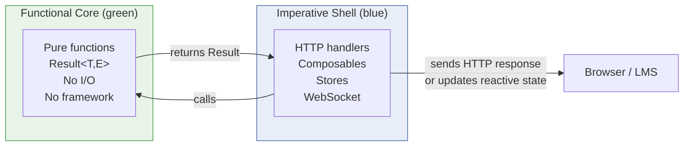
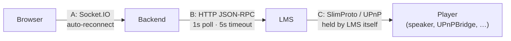

# Signalform Architecture

Canonical reference for structure, import boundaries, runtime connections,
and allowed exceptions. `AGENTS.md` carries a short operative summary of the
same rules — if the two disagree, this file wins.

## Contents

- [System context](#system-context)
- [Core principles](#core-principles)
- [Allowed exception policy](#allowed-exception-policy)
- [Package layout](#package-layout)
- [Shared package](#shared-package)
- [Backend structure](#backend-structure)
- [Frontend structure](#frontend-structure)
- [FCIS in one picture](#fcis-in-one-picture)
- [Runtime connections](#runtime-connections)
- [Enforcement strategy](#enforcement-strategy)
- [Conventions](#conventions-not-enforced-by-lint)

---

## System context

What Signalform is, who uses it, and which external systems it talks to.



**Signalform does not replace LMS.** LMS handles all audio output, library
scanning, and streaming-service authentication. Signalform is a UI layer on
top of the LMS JSON-RPC API.

**No direct Tidal/Qobuz API calls.** Signalform talks to LMS, which uses its
own plugins to reach the streaming services — so Signalform never needs
streaming-service credentials.

**Single deployable unit.** The Fastify backend serves the compiled Vue
frontend as static files. One container, one port (`3001`).

---

## Core principles

Signalform uses an explicit `functional core / imperative shell` architecture.

- Use functions instead of classes.
- Prefer immutable data and `const`.
- Use `Result` types for business-flow failures instead of exception-driven control flow.
- Keep framework and I/O concerns out of `core`.
- Make architectural roles visible in paths and enforce them through lint rules.

## Allowed exception policy

Exceptions are permitted only at explicit boundary seams:

- process entrypoints and shutdown paths
- hard safety guards that must stop execution immediately
- framework-required glue code in shell/infrastructure layers
- unavoidable third-party integration seams where APIs throw or mutate

Every exception must be local, explicitly commented, and must not silently
weaken architecture rules for neighboring code.

---

## Package layout

The monorepo has three packages. Import direction is strictly one-way:



`packages/shared` is imported by both backend and frontend and imports from
neither. Backend and frontend **never import from each other**.

## Shared package

`packages/shared` (`@signalform/shared`) is pure TypeScript with zero runtime
side effects. No framework imports, no I/O.

```
packages/shared/src/
├── result/          Result<T, E> type and helpers (ok, err, map, ...)
├── types/           Track, QueueState, SourceType, RepeatMode, WebSocket events
├── validation/      Zod schemas for WebSocket payloads
├── formatting/      formatSeconds, formatProgress
├── tidalUtils.ts    isTidalAlbumId pure helper
└── index.ts         single barrel export
```

Rules: no `await`, no `fetch`, no `fs`, no framework imports, named exports
only, all properties `readonly`.

---

## Backend structure

```
packages/backend/src/
├── adapters/              external system clients (LMS, Last.fm, Fanart.tv)
├── features/              feature modules, each with core/ and shell/
│   └── {feature}/
│       ├── core/          pure logic: no await, no Fastify, no I/O
│       └── shell/         Fastify routes, websocket emission, orchestration
├── infrastructure/        backend-internal technical helpers
│   ├── config/            config file I/O and parsing
│   ├── websocket/         Socket.IO server, event handlers, status poller
│   ├── logger.ts          Pino logger setup
│   ├── lms-registry.ts    runtime LMS client registry
│   ├── normalizeArtist.ts artist name normalisation utility
│   ├── frontend-delivery.ts static file serving helper
│   └── http-errors.ts     shared sendLmsError helper for route handlers
└── test-utils/            test safety guards and Vitest setup
```



Both zone directories are optional. A feature with no domain logic of its own
is shell-only (e.g. `genre-radio`, `tag-search`, `lastfm-love`); a pure helper
feature is core-only (e.g. `source-hierarchy`). Do not create empty zone
directories to satisfy the pattern. The same applies to frontend domains and
their optional `ui/` directory.

`infrastructure/` contains backend-wide technical helpers that are not
feature-specific and not part of the domain model. It is distinct from
`packages/shared` (the monorepo-level package) — `infrastructure/` is only
accessible within the backend and may perform I/O.

### Backend dependency rules

- `features/*/core` may import only:
  - same-feature `core`
  - `packages/shared` (pure types and utilities)
  - `infrastructure/config` and other pure infrastructure helpers
  - another feature's core through its public index, provided that feature is
    itself pure (pure-to-pure only, e.g. `source-hierarchy`)
  - adapter **types** (type-only imports, e.g. `SearchResult`) — never adapter
    runtime code
- `features/*/core` may not import:
  - Fastify
  - websocket runtime/server code (`infrastructure/websocket/**`)
  - adapter clients
  - same-feature `shell`
- `features/*/shell` may import:
  - same-feature `core`
  - `adapters`
  - `infrastructure`
- `adapters` may not import feature `shell`
- `infrastructure` must not depend on feature-local business rules

---

## Frontend structure

```
packages/frontend/src/
├── app/                   bootstrap, router wiring, top-level assembly
├── platform/api/          HTTP/API clients (shell layer)
├── ui/                    generic reusable UI components
├── domains/
│   ├── shared/core/       cross-domain pure types (api-errors.ts, etc.)
│   └── {domain}/
│       ├── core/          pure logic: no Vue imports, no I/O
│       ├── shell/         composables, stores, API calls
│       └── ui/            domain-specific Vue components
├── router/                Vue Router setup
├── i18n/                  internationalisation
└── utils/                 shared pure utilities
```



`domains/shared/core/` holds cross-domain pure types (e.g. `BaseApiError`,
`NotFoundError`) that domain cores import instead of repeating the same union
literals. It is not a shell layer — no Vue imports, no I/O.

### Frontend dependency rules

- `domains/*/core` may not import:
  - Vue runtime
  - Pinia
  - router
  - `platform/api`
- `domains/shared/core` follows the same rules as any other domain core
- `domains/*/shell` may import:
  - same-domain `core`
  - `domains/shared/core`
  - `platform/api`
  - generic `ui`
- `domains/*/ui` may import:
  - same-domain `core`
  - same-domain `shell`
  - generic `ui`
- generic `ui/**` may not import:
  - `platform/api`
  - domain stores directly
- `app/**` may assemble domains but should not contain business logic

---

## FCIS in one picture



The shell translates between the messy outside world (HTTP, WebSockets,
reactive state) and the clean inside world (pure functions, typed errors).

---

## Runtime connections

Three independent connections hide behind the phrase "the LMS connection".
They fail separately and are detected separately — confusing them is the usual
cause of "the player is behaving strangely".



**A — Browser ↔ Backend (Socket.IO).** One app-wide socket
(`frontend/src/app/useWebSocket.ts`) with unlimited reconnect attempts and
1s→5s backoff. Its `connectionState` (`connecting | connected | disconnected |
reconnecting`) is exposed to the UI.

**B — Backend ↔ LMS (HTTP JSON-RPC polling).** LMS pushes nothing. The status
poller (`backend/src/infrastructure/websocket/status-poller.ts`) calls
`getStatus()` once per second and broadcasts the result over Socket.IO; each
request has a 5s timeout. On failure it emits `system.lmsDisconnected`, and
`system.lmsReconnected` once LMS answers again.

**C — LMS ↔ Player (SlimProto/UPnP).** Held by LMS itself, outside our code.
A player losing its network leaves connection B completely healthy — LMS still
answers HTTP normally. It is therefore detected on a separate axis: the poller
tracks `playerConnected` and emits `system.playerDisconnected` /
`system.playerReconnected` on a true→false transition.

---

## Enforcement strategy

Architecture is enforced by four layers:

- TypeScript strictness — type-safety and null-safety invariants
- `eslint-plugin-functional` — functional style and immutability constraints
- `eslint-plugin-boundaries` — path-based import and layering rules
- `dependency-cruiser` (`pnpm run check:arch`) — import cycles and Node
  builtins in `core/`

All architecture rules are enforced at `error` level. Violations fail lint and
CI. The ESLint boundary rules use glob patterns, so new features and domains
are covered automatically without manual config updates.

## Conventions (not enforced by lint)

- **Naming**: camelCase for variables/functions, PascalCase for types,
  kebab-case for files and directories.
- **Booleans**: prefix with `is`, `has`, `can`, `should`.
- **Import order**: external libs, then `@signalform/shared`, then absolute
  (`@/...`), then relative.
- **Vue components**: always `<script setup lang="ts">`. Use `data-testid`
  attributes for test selectors.
- **Comments**: explain the "why", not the "what". See the comment rules in
  `AGENTS.md`.

## Known limitations

Deliberate boundaries of the current design, not defects. They are listed
here so a reader stops looking for the mechanism that is genuinely absent.

- **No authentication.** Signalform assumes it runs on a trusted network. The
  `x-signalform-user` header is a profile selector, not a credential: the
  client sets it, the server believes it, and any caller can claim any user.
  It routes Last.fm scrobbles, loves and Personal Radio to the right profile —
  it protects nothing. Do not expose an instance to the open internet.
- **One player per instance.** The LMS player is a single value in the
  configuration, chosen in the setup wizard. Radio mode holds its state in a
  process-wide singleton (`radio-mode/shell/radio-state.ts`), so it belongs to
  the instance rather than to a player. Controlling a second player means a
  second configuration, not a second tab.
- **The LMS is the library.** Signalform stores no music metadata of its own
  and caches only for a TTL. Anything LMS cannot answer — a sort it does not
  offer, a field it does not tag — cannot be added on this side without
  reading the whole library into memory first, which is the trade this
  architecture deliberately refuses.
- **iOS keeps no audio in the background.** Playback runs on the LMS player,
  not in the browser, so this only affects the interface: a backgrounded
  standalone PWA on iOS is suspended and reconnects its WebSocket on return.
