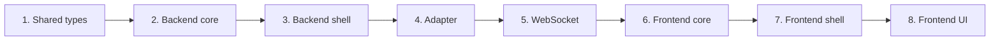
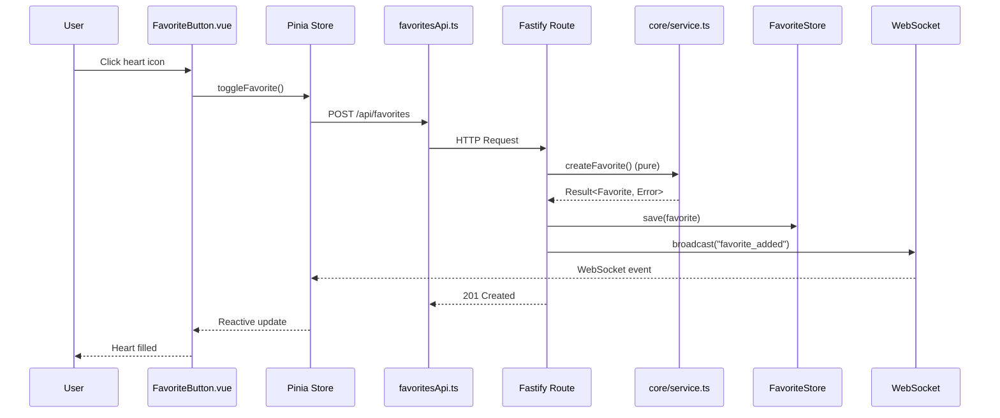

# Feature Implementation Example: Favorite Tracks

A walkthrough of implementing a feature across all three packages,
following FCIS (Functional Core / Imperative Shell).

**Feature**: Users can mark tracks as favorites and view their favorites list.

---

## Implementation order



---

## Step 1: Shared types

Define types and validation schemas that both backend and frontend use.

`packages/shared/src/types/favorite.ts`:

```typescript
export type Favorite = {
  readonly id: string;
  readonly trackId: string;
  readonly trackUrl: string;
  readonly title: string;
  readonly artist: string;
  readonly album: string;
  readonly addedAt: Date;
};

export type FavoriteError =
  | { readonly type: "TRACK_NOT_FOUND"; readonly trackId: string }
  | { readonly type: "ALREADY_FAVORITED"; readonly trackId: string }
  | { readonly type: "NOT_FAVORITED"; readonly trackId: string }
  | { readonly type: "PERSISTENCE_ERROR"; readonly message: string };
```

`packages/shared/src/validation/favorite.ts`:

```typescript
import { z } from "zod";

export const AddFavoriteRequestSchema = z.object({
  trackId: z.string().min(1),
  trackUrl: z.string().url(),
  title: z.string().min(1),
  artist: z.string().min(1),
  album: z.string().min(1),
});
```

Export both from `index.ts`.

---

## Step 2: Backend core (pure logic)

`features/favorites/core/service.ts` -- no `await`, no Fastify, no I/O:

```typescript
import { ok, err, type Result } from "@signalform/shared";
import type { Favorite, FavoriteError } from "@signalform/shared";

export const createFavorite = (
  command: AddFavoriteRequest,
): Result<Favorite, FavoriteError> => {
  return ok({
    id: uuidv4(),
    ...command,
    addedAt: new Date(),
  });
};

export const isAlreadyFavorited = (
  favorites: readonly Favorite[],
  trackId: string,
): boolean => favorites.some((fav) => fav.trackId === trackId);
```

Test in `core/service.test.ts` -- pure assertions, no mocks needed.

---

## Step 3: Backend shell (API routes)

`features/favorites/shell/routes.ts` -- thin handler, orchestrates core + adapter:

```typescript
fastify.post("/api/favorites", async (request, reply) => {
  // 1. Validate input (Zod)
  const validation = AddFavoriteRequestSchema.safeParse(request.body);
  if (!validation.success) return reply.code(400).send({ ... });

  // 2. Check duplicate (pure function)
  const existing = await favoriteStore.loadAll();
  if (isAlreadyFavorited(existing, validation.data.trackId))
    return reply.code(409).send({ ... });

  // 3. Create favorite (pure function)
  const result = createFavorite(validation.data);
  if (!result.ok) return reply.code(400).send({ error: result.error });

  // 4. Persist (I/O)
  await favoriteStore.save(result.value);

  // 5. Broadcast + respond
  broadcaster.broadcast("favorite_added", { favorite: result.value });
  return reply.code(201).send({ favorite: result.value });
});
```

Integration test with real Fastify instance, mocked adapter.

---

## Step 4: Adapter (persistence)

`adapters/favorite-store/client.ts` -- defines the I/O interface:

```typescript
export type FavoriteStore = {
  readonly save: (fav: Favorite) => Promise<Result<void, FavoriteError>>;
  readonly loadAll: () => Promise<readonly Favorite[]>;
  readonly delete: (id: string) => Promise<Result<void, FavoriteError>>;
};
```

Implementation uses file-based JSON storage. Could be swapped for a database
without changing core or shell.

---

## Step 5: WebSocket events

Add `favorite_added` and `favorite_removed` to the WebSocket event union.
The shell route broadcasts after persisting; connected clients receive
updates in real time.

---

## Step 6: Frontend core (mappers)

`domains/favorites/core/mappers.ts` -- no Vue, no I/O:

```typescript
import type { Favorite } from "@signalform/shared";

export type FavoriteInfo = {
  readonly id: string;
  readonly trackId: string;
  readonly title: string;
  readonly artist: string;
  readonly album: string;
  readonly addedAtFormatted: string;
};

export const mapFavoriteToInfo = (fav: Favorite): FavoriteInfo => ({
  id: fav.id,
  trackId: fav.trackId,
  title: fav.title,
  artist: fav.artist,
  album: fav.album,
  addedAtFormatted: new Date(fav.addedAt).toLocaleDateString(),
});
```

---

## Step 7: Frontend shell (store)

Pinia store calls the API, maps through core, handles WebSocket events:

```typescript
export const useFavoritesStore = defineStore("favorites", () => {
  const favorites = ref<readonly FavoriteInfo[]>([]);

  const loadFavorites = async (): Promise<void> => {
    const response = await listFavoritesApi();
    favorites.value = response.favorites.map(mapFavoriteToInfo);
  };

  const handleFavoriteAdded = (fav: Favorite): void => {
    favorites.value = [...favorites.value, mapFavoriteToInfo(fav)];
  };

  return { favorites, loadFavorites, handleFavoriteAdded /* ... */ };
});
```

A `useFavorites()` composable wraps the store for simpler component usage
(e.g. `toggleFavorite()`).

---

## Step 8: Frontend UI

`FavoriteButton.vue` uses the composable:

```vue
<script setup lang="ts">
const { isFavorited, toggleFavorite } = useFavorites();
const favorited = computed(() => isFavorited(props.track.id));
</script>

<template>
  <button
    @click="toggleFavorite(track)"
    :aria-label="favorited ? 'Remove' : 'Add'"
  >
    <HeartIcon :filled="favorited" />
  </button>
</template>
```

---

## Complete request flow



---

## Key takeaways

1. **Types flow outward**: shared -> backend/frontend core -> shell -> UI
2. **Core stays pure**: no `await`, no framework, errors as `Result<T, E>`
3. **Shell is thin**: validate -> call core -> call adapter -> respond
4. **Adapter is swappable**: interface defined in adapter, implementation can change
5. **WebSocket keeps clients in sync** without polling
6. **Every layer is testable in isolation**
