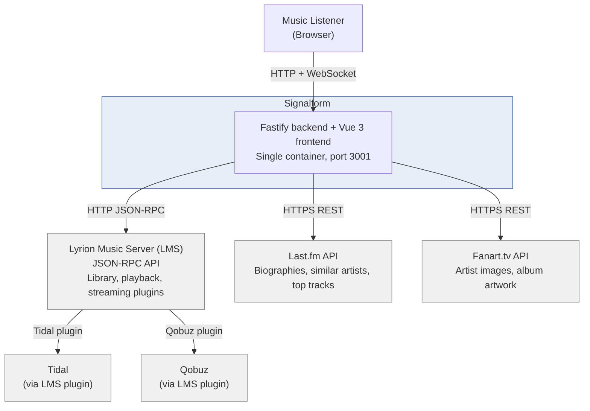

# System Context

Shows what Signalform is, who uses it, and which external systems it talks to.

## Key decisions

**Signalform does not replace LMS.** LMS handles all audio output, library
scanning, and streaming-service authentication. Signalform is a UI layer
on top of LMS's JSON-RPC API.

**No direct Tidal/Qobuz API calls.** Signalform talks to LMS, which uses
its own plugins to communicate with the streaming services. This means
Signalform does not need streaming-service credentials.

**Single deployable unit.** The Fastify backend serves the compiled Vue
frontend as static files. One container, one port (`3001`).
