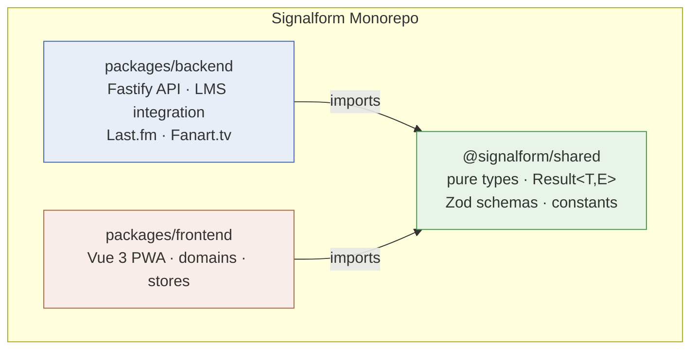
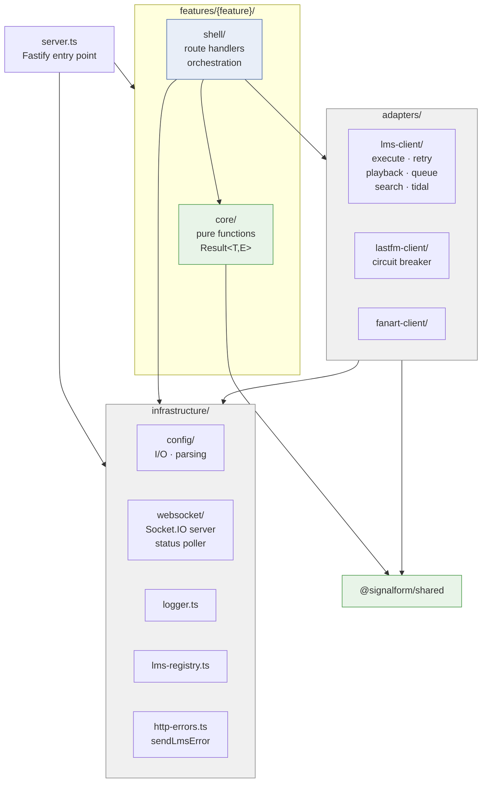
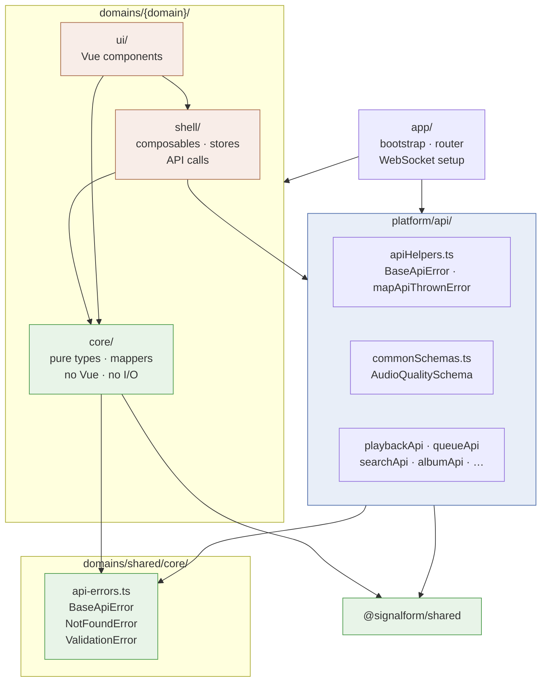
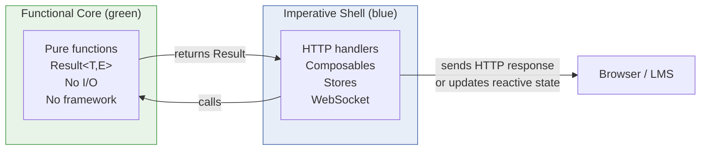

# Package Dependencies

Shows the three monorepo packages and the internal layer structure of each.

## Package-level dependencies

Backend and frontend **never import from each other**.
`packages/shared` has zero imports from either.

---

## Backend internal layers

**Enforced constraint:** `core/` may not import from `shell/`, `adapters/`,
or `infrastructure/websocket/**`. Violations fail ESLint (`eslint-plugin-boundaries`).

---

## Frontend internal layers

**Enforced constraint:** `domain core` may not import from `platform/api`,
Vue, Pinia, or any shell module. Violations fail ESLint.

---

## FCIS in one picture

The shell translates between the messy outside world (HTTP, WebSockets,
reactive state) and the clean inside world (pure functions, typed errors).
